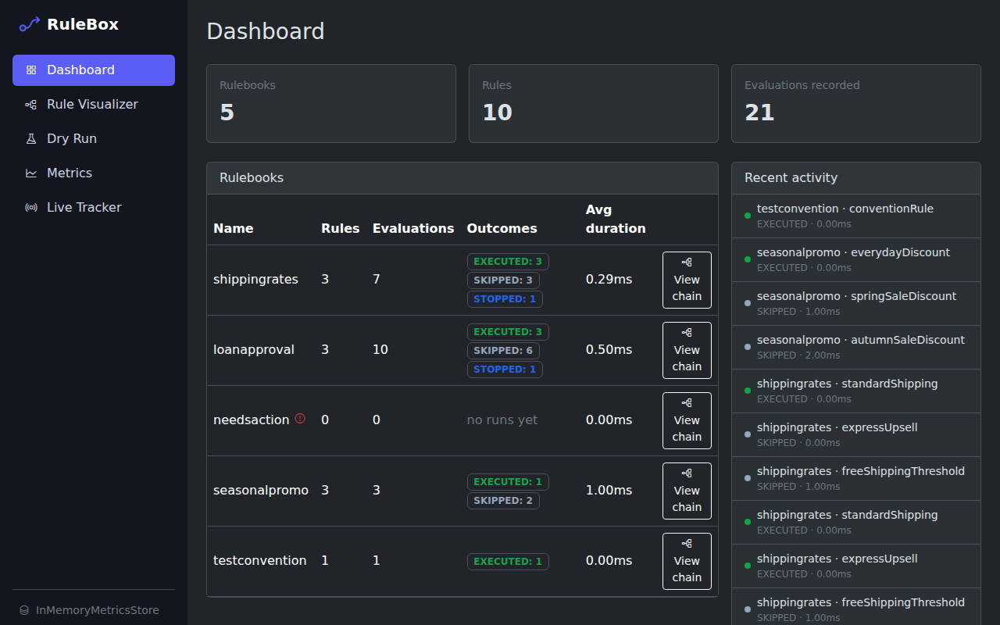
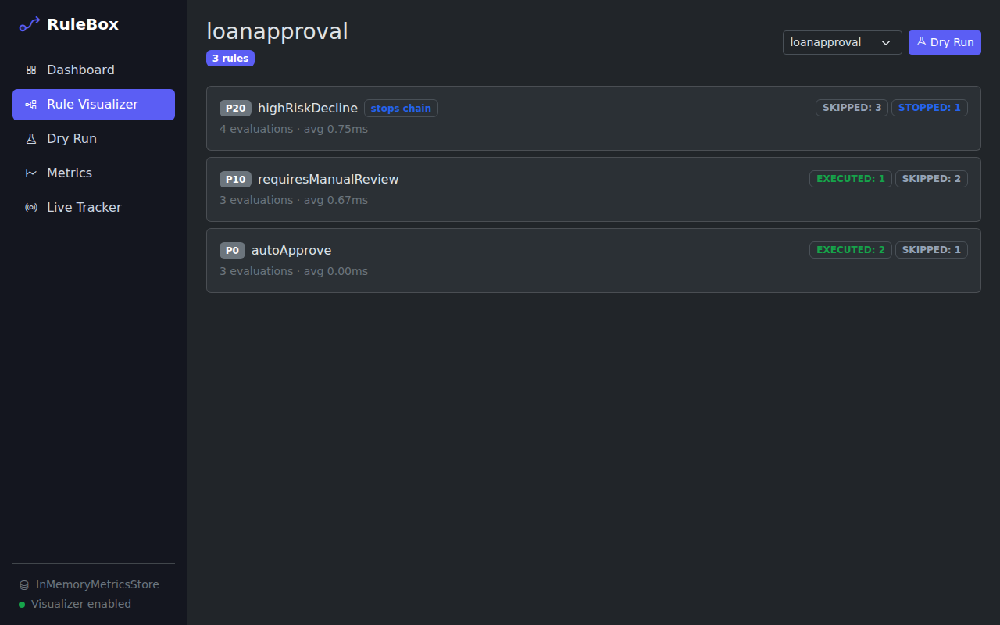
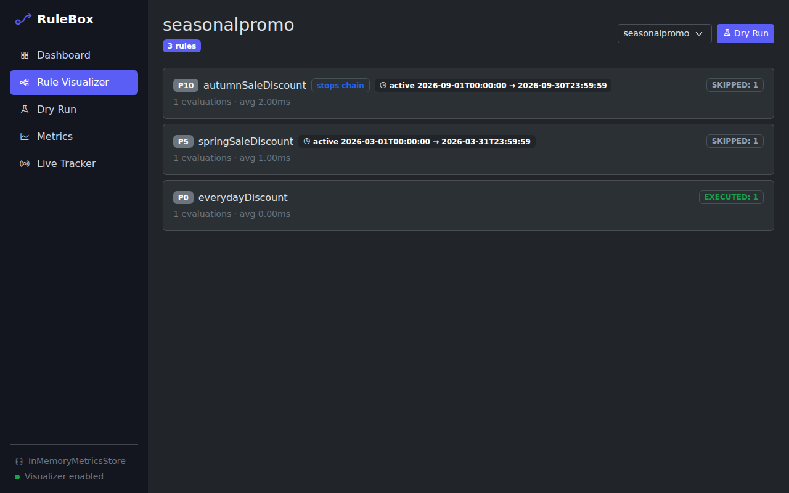
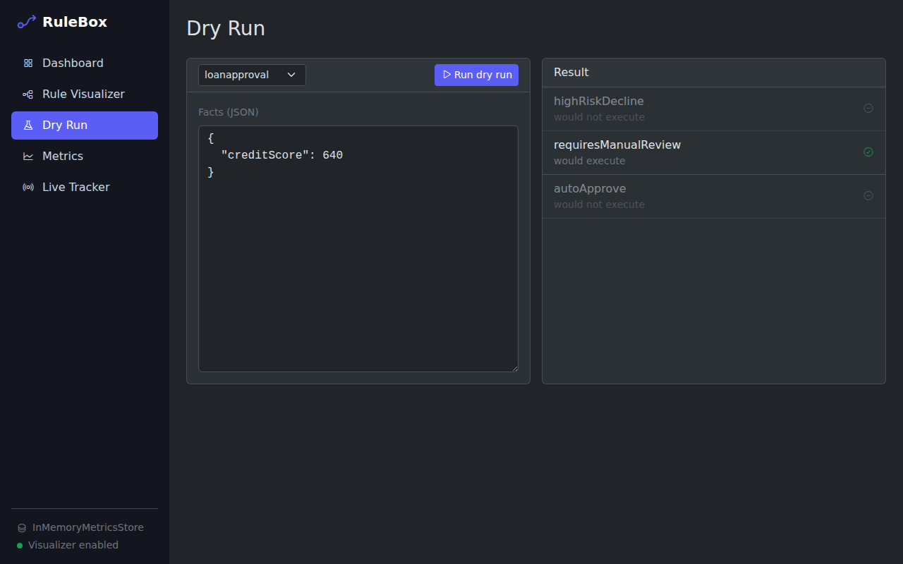
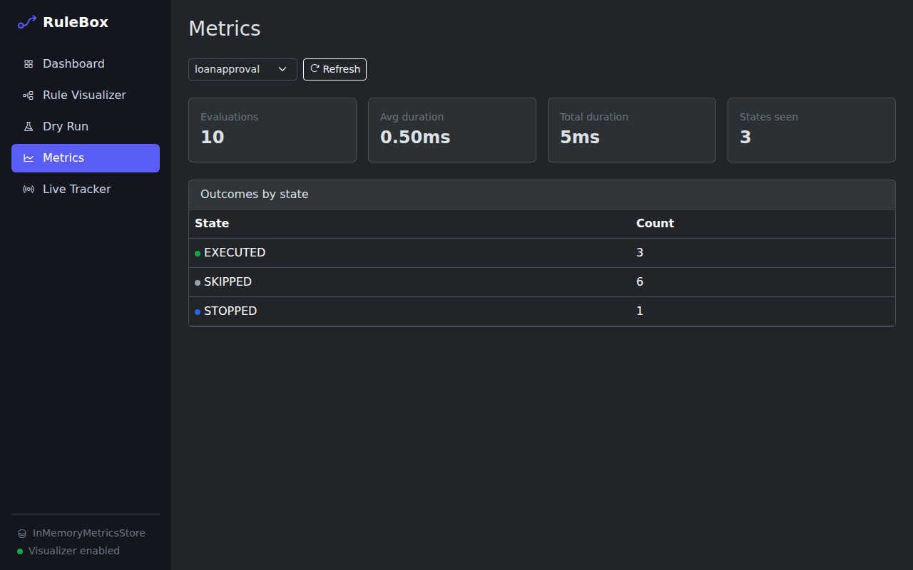

# Rule Visualizer

The Rule Visualizer is an admin UI for RuleBox: a dashboard of your declared
rulebooks, a chain visualizer showing real execution order, a dry-run
playground, metrics/stats, and a live SSE tracker. It's modeled on
cbSecurity's own visualizer - off by default, and not secured by RuleBox
itself.

## Enabling it

```cfc
moduleSettings = {
	rulebox = {
		visualizer = {
			enabled = true
		}
	}
}
```

That's it - `enabled` is the only thing you strictly need. Once on, the UI
lives at `/rulebox-visualizer/visualizer/index` (and friends), via the
module's `this.entryPoint = "rulebox-visualizer"`.

While `enabled` is `false` (the default), every visualizer route 404s, and -
just as importantly - RuleBox does no extra work at all: no metrics are
persisted, and nothing is broadcast. Flipping it on is the only thing that
turns on the (small) per-rule-evaluation bookkeeping cost.

**RuleBox does not secure these routes for you.** Once you enable the
visualizer, wrap `/rulebox-visualizer` with a cbSecurity rule (or your own
auth interceptor) the same way you would any other admin UI.

## Opening the UI

With `enabled = true`, browse to your app's `/rulebox-visualizer` entry point:

| Screen | URL |
|--------|-----|
| Dashboard | `/rulebox-visualizer/visualizer/index` |
| Rule Visualizer (chain) | `/rulebox-visualizer/visualizer/chain?name={rulebook}` |
| Dry Run | `/rulebox-visualizer/visualizer/dryrun` |
| Metrics | `/rulebox-visualizer/visualizer/metrics` |
| Live Tracker | `/rulebox-visualizer/visualizer/live` |

The left sidebar links between the screens. The footer shows the metrics
store in use and confirms the visualizer is enabled.

The UI itself is Bootstrap 5, Alpine.js, and Phosphor Icons, loaded from a
CDN - there's nothing to build or bundle. The screenshots below use the
rulebooks in this module's own `test-harness/config/rulebox` folder.

## Screens

### Dashboard



Every declared rulebook (from `moduleSettings.rulebox.rulebooks` and/or your
convention folder - see the "Externalized Rule Definitions" guide), with its
rule count, evaluation counts by state, average duration, and a
recent-activity feed on the right. A rulebook that fails to load (a bad file
path, an unregistered action) is flagged with a red marker, like
`needsaction` above, instead of taking the whole page down.

### Rule Visualizer



A chosen rulebook's real execution chain, in the order the rules actually
run. Each row shows:

- the rule's **priority** (`P20`, `P10`, `P0`)
- a **stops chain** marker for rules that call `stop()`
- the rule's **evaluation count, average duration, and outcomes by state** (`EXECUTED`, `SKIPPED`, `STOPPED`)

Use the dropdown to switch rulebooks, or **Dry Run** to jump to the playground
with this rulebook preselected.



Rules with an active window (`activeFrom` / `activeUntil`) show it inline.

### Dry Run



Pick a rulebook, paste facts as JSON, and press **Run dry run**. The result
lists every rule in order and whether it **would execute** for those facts,
without running any action. It is backed by `RuleBook.dryRun()`, so nothing
is recorded in your metrics.

### Metrics



Aggregated stats for one rulebook: total evaluations, average and total
duration, and a count per outcome state. Pick a rulebook and press
**Refresh** to re-query.

### Live Tracker

Every rule evaluation, across every rulebook, streamed to the browser as it
happens via [BoxLang's `SSE()`](https://boxlang.ortusbooks.com/boxlang-framework/server-sent-events).
Each row shows the time, rulebook, rule, outcome state, and duration. Use
**Pause** to freeze the table while you read it; the table keeps the latest
200 rows.

## Metrics persistence

Every rule evaluation is recorded through `RuleEventBus@rulebox`, which fans
it out to two places: the configured metrics store (for the dashboard/metrics
screens) and any live subscribers (the SSE tracker). The store is
swappable:

```cfc
moduleSettings = {
	rulebox = {
		visualizer = {
			enabled        = true,
			// A WireBox mapping ID - swap in your own implementation of IMetricsStore@rulebox
			metricsStore   = "InMemoryMetricsStore@rulebox",
			// Only read by SQLiteMetricsStore, if you opt into it below
			datasourceName = "rulebox_visualizer"
		}
	}
}
```

### The default: in-memory

`InMemoryMetricsStore@rulebox` is the default - zero setup, live broadcast
and the dashboard/metrics screens work immediately after enabling the
visualizer. The tradeoff: nothing survives a restart.

### Persisting across restarts: SQLite

For metrics that survive a restart, point `metricsStore` at
`SQLiteMetricsStore@rulebox` instead. It persists events to a
`rulebox_events` table (auto-created on first use) via the
[`bx-sqlite`](https://forgebox.io/view/bx-sqlite) BoxLang module. It requires:

1. `bx-sqlite` installed (`box install bx-sqlite`) and registered with your
   engine so its JDBC driver is available - how you do this depends on your
   engine/environment, so verify it independently of RuleBox
2. A datasource registered under the name in `datasourceName` (default `rulebox_visualizer`), e.g. in `Application.bx`:

```cfc
this.datasources = {
	rulebox_visualizer: {
		driver: "sqlite",
		database: "./.database/rulebox_visualizer.db"
	}
}
```

Neither the module nor the datasource is installed/registered for you - if
you opt into this store, you set these up yourself. If `bx-sqlite` or the
datasource isn't available, RuleBox logs it and keeps going: live broadcast
still works, nothing gets persisted.

### Swapping it out

Implement `IMetricsStore@rulebox` (`recordEvent`, `queryEvents`,
`queryRuleBookSummary`, `queryRuleMetrics`, `queryRuleBookNames`, `reset`)
and point `metricsStore` at your WireBox mapping - a Redis-backed store, a
real RDBMS table via `qb`, whatever fits your app.

## What it doesn't do

The condition tree behind a `when()`/`except()` closure isn't introspectable
once compiled, so the chain visualizer shows what's inspectable on a live
`Rule` - name, priority, `stop()`, active window, metrics - not a decompiled
condition. Access control is also entirely on you; see above.
